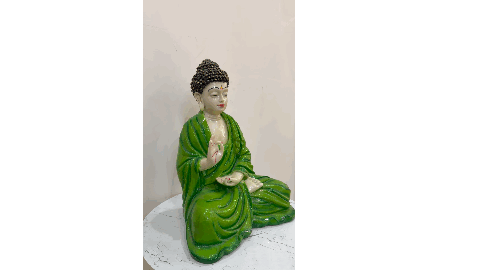
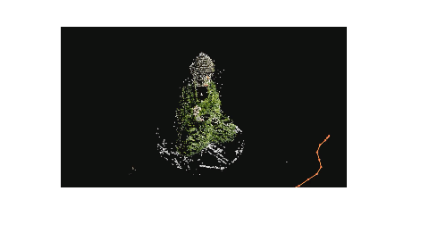

# Structure-from-Motion-Video

Turns a video taken with a single moving camera into a **coloured 3D point cloud**.

Pipeline:
- Divide video into snapshots at 2 frames per second
- Detect keypoints in first two frames using SIFT and match correspondences
- Estimate the Essential matrix with RANSAC to reject outlier matches
- Given image points (x) and Essential matrix (P), triangulate matched points (X) to get initial 3D points (x = PX)
- Register each new view with PnP + RANSAC against existing 3D points, then triangulate new points
- Refine all camera poses jointly with Bundle Adjustment (minimise reprojection error)
- Export the coloured point cloud (.ply) for viewing in MeshLab / Open3D

| Input video | Output 3D point cloud |
|:-----------:|:---------------:|
|  |  |

## Run

```bash
# 1. Create environment
python -m venv venv && source venv/bin/activate
pip install -r requirements.txt

# 2. Convert video to frames
python extract_frames.py --video data/videos/my_video.MOV --out data/my_video --fps 2

# 3. Convert to 3D point cloud
python reconstruct.py --frames data/my_video --out outputs/my_video
```

Each output folder contains:
- `pointcloud_360.mp4`: a video orbiting the reconstruction.
- `points.ply`: the coloured point cloud, for MeshLab or CloudCompare.

## Pipeline

```
frames ─► SIFT + ratio test ─► F: normalised 8-point + RANSAC ─► inlier matches
  frames 0,1 :  E = Kᵀ Fᵀ K ─► (R, t) via cheirality ─► P0 = K[I|0], P1 = K[R|t] ─► triangulate (DLT)
  frame k    :  matches with k-1 whose keypoint already has a 3D point ─► PnP ─► P_k ─► triangulate new points
  all frames :  bundle adjustment: refine every P_i, every X_j and the focal length
```

**Capturing your own video.** Walk sideways or around the object; turning on the spot gives no depth. Keep the scene static and textured. Choose `--fps` so that consecutive frames clearly differ but still overlap. For slow hand-held motion, 2–3 fps works.

**Limitation**: It is not possible to recover the absolute scale of the scene, only relative.
